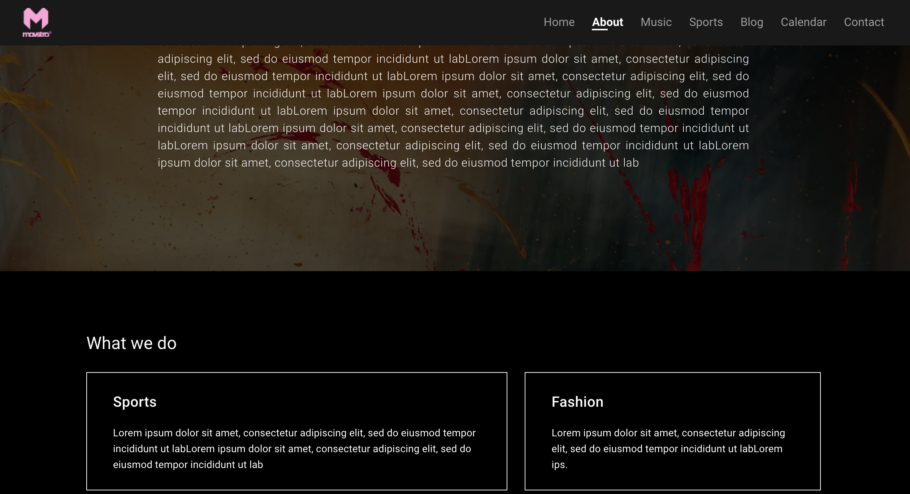
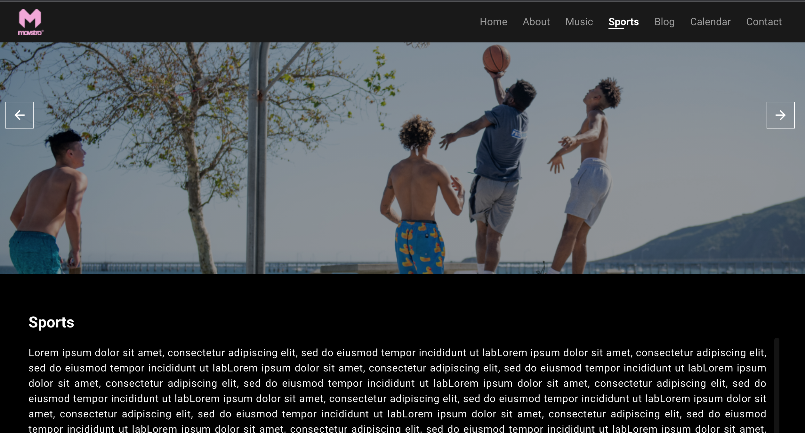
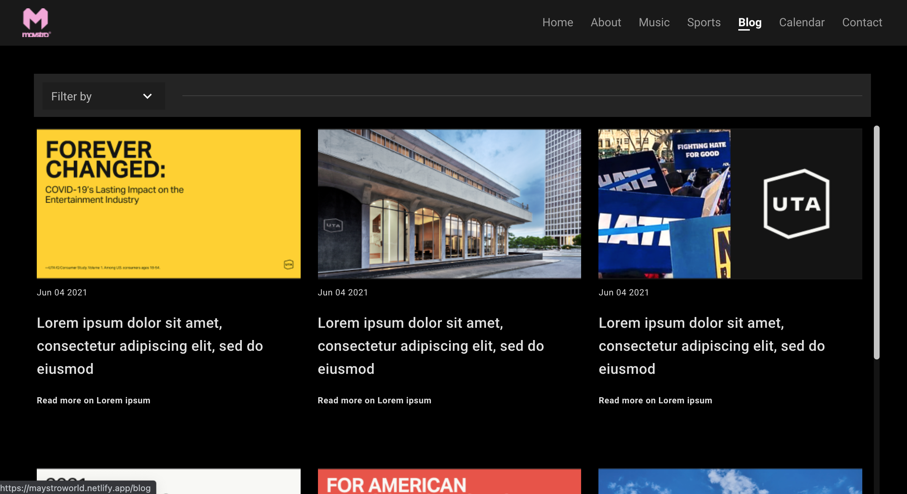

# MaystroWorld Website

Table of Content


## About this Project
MAystroWorld.com is a website for MaystroWorld where you can read about their company and also read about their blog Post.

## List of Pages
- Home Page
- About Page
- music page
- sport page
- blog page
- calendar page
- contact page

## Images

Index Page
- 

About Page
- 

Music Page
- 

Sport Page
- 

Blog Page
- 

Calendar Page
- 

Contact Page
- 


## Built With
This website was built with the technologies below:
- HTML
- [VUE.JS](https://cli.vuejs.org/config/)  
- CSS
- JAVASCRIPT


## Getting Started

## Project setup
```
npm install
```

### Compiles and hot-reloads for development
```
npm run serve
```

### Compiles and minifies for production
```
npm run build
```
## Contact
[Website](http://helixgade.com)

## SOCIALS

- [Instagram](https://instagram.com/helixgade)
- [Twitter](https://twitter.com/helixgade)
- [Facebook](https://facebook.com/helixgade)


### Customize configuration
See [Configuration Reference](https://cli.vuejs.org/config/).


# MaystroWorldWebsite
